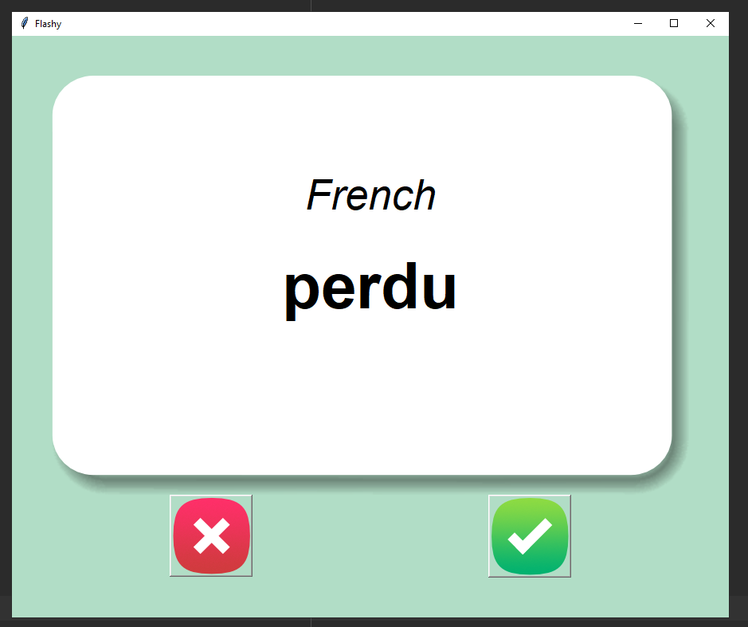

# Day 31:
#100DaysOfCode

It's day 31 of the 100 Days of Code Challenge! Today I build a language learning flash card program from scratch. If you ever wanted to learn some French words, this is your program ;)
 
 
Here is a preview:
 
