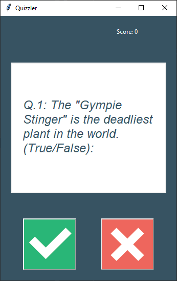

# Day 34:
#100DaysOfCode

It's day 33 of the 100 Days  of Code Challenge! Today I practiced more API and GUI related stuff by improving out day 17 quiz program by calling an API for random questions and building an GUI around it.

Here is a preview:
 
