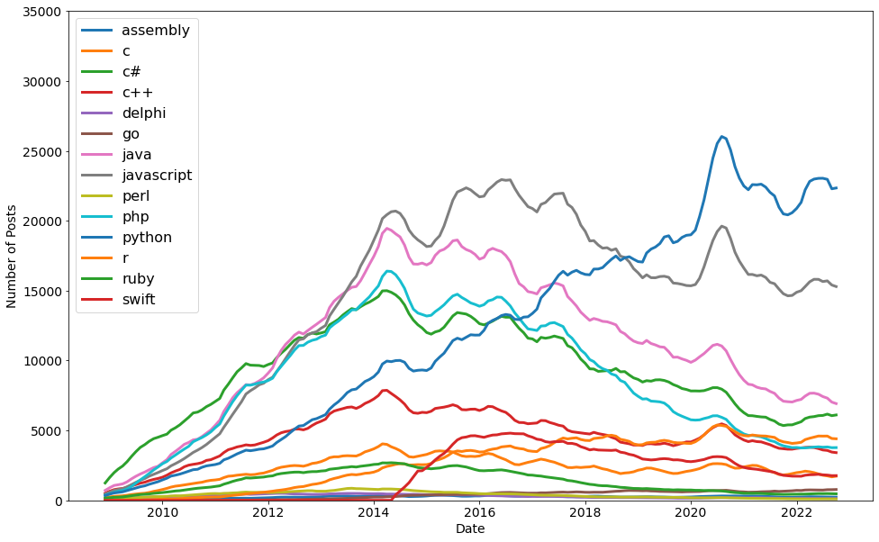

# Day 72:
#100DaysOfCode

It's day 72 of the 100 Days of Code Challenge! Today I used matplotlib to visualize how many posts in what programming language got posted on stackoverflow. It sounds like a simple task, but it was pretty difficult working with it for the first time :D
 
 
 
