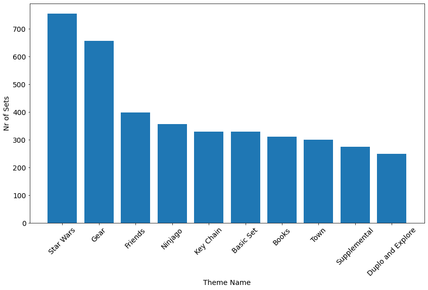

# Day 73:
#100DaysOfCode

It's day 73 of the 100 Days of Code Challenge! Today i learned more on how to use Pandas and Matplotlib. I got to learn some new functions and reused some previously learned functions. I learned what agg() does how to rename and merge DataFrames.

We used Data from Lego and Legosets to find out what themes has the most number of sets. Not surprisingly its Star Wars :D
 
 
