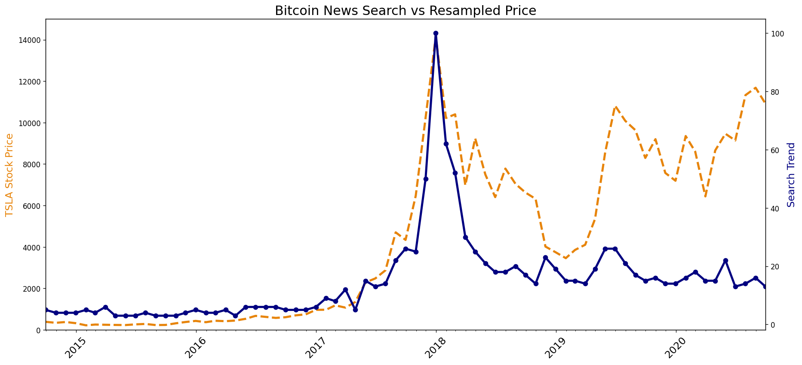
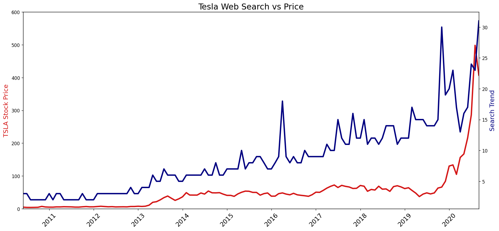

# Day 74:
#100DaysOfCode

It's day 74 of the 100 Days of Code Challenge! Today continued to use Pandas and Matplotlib. There where a lot of repetition but also new material. As Data we used some Google Search Data about Bitcoin and Tesla related stuff like News and stockprice.
 
 

 
