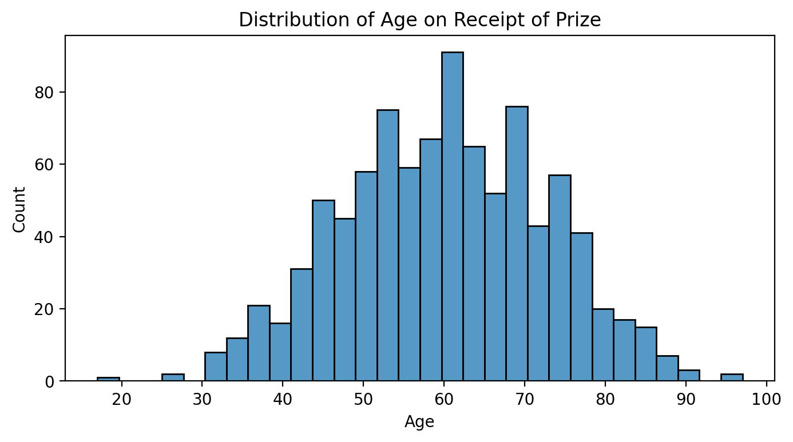

# Day 78:
#100DaysOfCode

It's day 78 of the 100 Days of Code Challenge! In todays lesson, we tossed everything together. Pandas, Matplotlib, Numpy, plotly and seaborn. We worked with Data about the Nobel prize Laureates.
 
 
