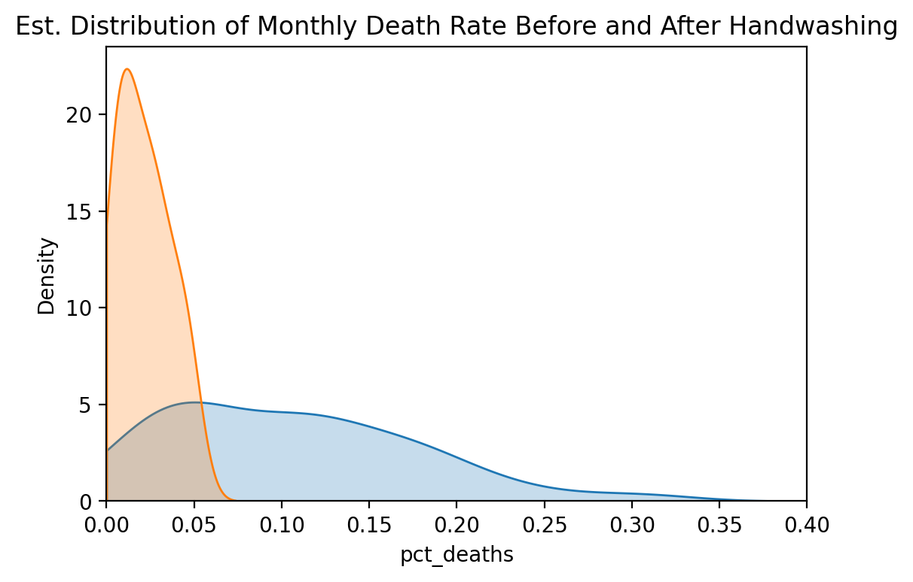

# Day 79:
#100DaysOfCode

It's day 79 of the 100 Days of Code Challenge! Today i used a KDE, a Kernel Density Estimate, and used scipy and test for statistical significance by looking at p-values. The Data we used came from Dr. Semmelweiss and showcased the tragic discovery of handwashing.
 
 
